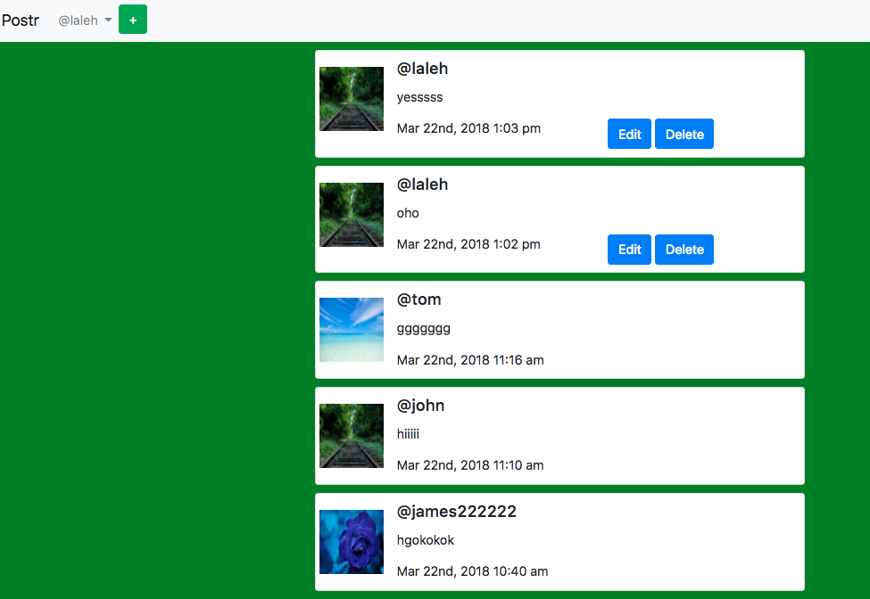
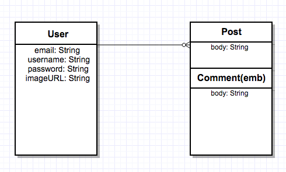

## Project #3

#    A Single Page Application  

 
   
            
           
         

  

    
 App logic:
---  
Created a single page app which has 2 seperate models. It has 2 controllers (userController.js and postController.js), an index.ejs file, views folder and finally the public folder in which we created the additional files such as css file to style the app, main.js. The app provides users a platform to write posts. Each user can delete or edit his own post and see posts of other users. If user is already a member of the app can log in otherwise needs to sign up.

  
 
Wireframe Diagram:
---
  
 

ERD Diagram:  
---

  
  
Installation instructions:  
--- 
### Create
* create a new repo 
* create a new app in it
* npm init
* npm install --save (all the packages in tools section) 

### Run  

* fork the repo on Git   
* git clone url in terminal  
* npm install

Tools:
---  
* HTML
* CSS
* Javascript
* JQuery
* express
* express-session  
* axios
* bcrypt-nodejs
* morgan
* socket.io  
* ejs
* body-parser
* cookie-parser
* connect-flash
* method-override
* mongoose
* passport
* passport-local
* bootstrap
* Chrome Developer Console
* Visual Studio Code
* MacDown

Resources:
---  
* [MDN Javascript Docs](https://developer.mozilla.org/en-US/docs/Web/JavaScript)  
* [jQuery Docs](https://api.jquery.com/)

Approach:
---
We started by clarifying the functionality of the app. Then we discussed the models we want to create. After that we wrote down the packages we need to create the app. The Project manager created a new repository and cloned it to his local computer then created the first files and push it to the git so that each member of the group were ready to clone the file to their computers. 

Then:

1. completed the models, routes and controller files.
1. created the passport authentication.
1. Add the bootstrap to the packege.
1. Public folder and css styles.
2. Added more functionalities to the app.
  

Future Enhancements:
---

  
1. Add another model to it like comments (emb model)
3. Drag and drop pictures, upload pictures from a local machine
1. Log In with Facebook or gmail account

Acknowledgements
---
#### Links

* [Heroku]()  
* [Github](https://github.com/lalehnastar/Project-3)  
* [Trello](https://trello.com/b/xqAA8772/project-3)

